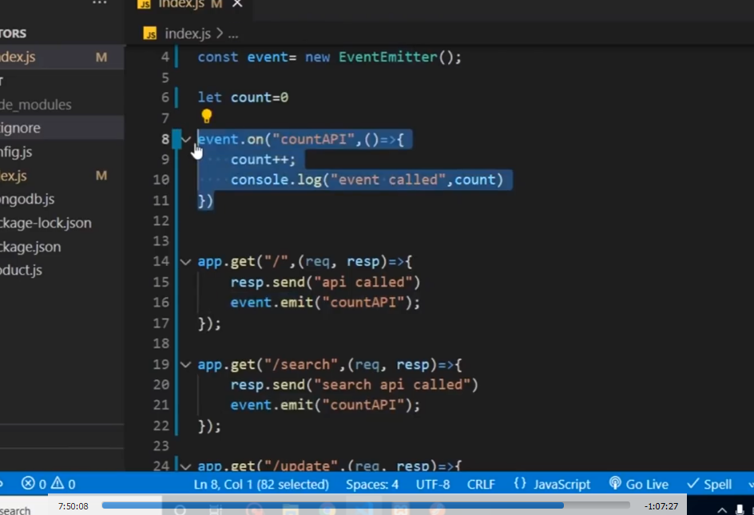
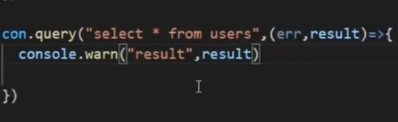

// middleware only use with routes.

// MongoDB CRUD Command

// To get MongoDB list ==> show dbs

// if you write use dbName then you will be switch to that database if exist , if it not then new DB will be created.

// ? if created db does not have any collection then that db doesn't show in GUI list as well as in CLI .

// \* To Create DB ==> use collectionName

// \* To Create collection in DB ==> db.createCollection( 'collectionName' )

// \* To delete dataBase ==> db.dropDatabase( 'dataBaseName' )

// \* To Show all the collection ==> show collections

// \* To delete DB ==> db.dropDatabase()

// \* To get current db ==> just type db and enter

// first got to the collection then ==> db.user.insertOne({ name:"", data:"" })

// This is to read ==> db.user.findOne() ==> This will return all the collection data.

// This will find specific data ==> db.collectionName.findOne({ keyToBeSearch:"propertyToBeSearch" })

// This is to update ==> db.user.updateOne({ brand:"apple" },{$set:{ fieldName:"updatedValue" }})

// This will delete data ==> db.user.deleteOne({ keyToiBeDelete:"propertyToBeDelete" })
